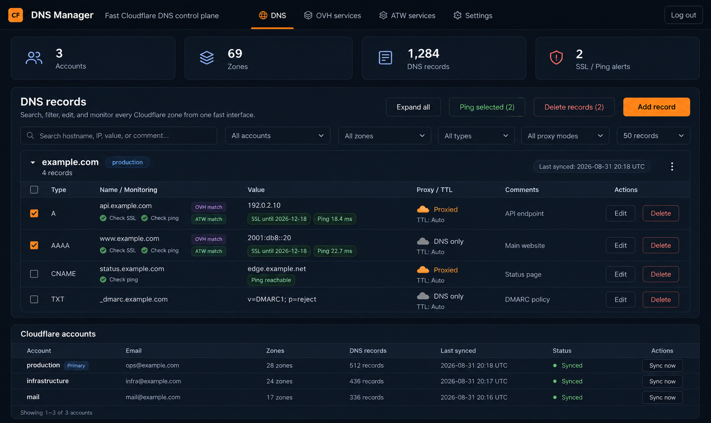

# CFDNS

CFDNS is a fast, self-hosted interface for managing Cloudflare DNS records across multiple accounts and zones. Its searchable local SQLite or PostgreSQL cache keeps browsing and filtering responsive, while record changes are sent directly to Cloudflare.



_Illustrative dashboard populated with fictional domains and documentation-only IP addresses._

## Features

- Fast Cloudflare DNS record interface backed by a searchable local cache
- Manage multiple Cloudflare accounts and zones from one dashboard using scoped API tokens
- Create, edit, delete, search, filter, and synchronize DNS records without moving between Cloudflare zones
- Bulk record selection with immediate concurrent ping checks and bulk deletion
- Per-IP SSL certificate and ping monitoring with Telegram failure and recovery alerts
- Cloudflare proxy status, TTL, comments, and monitoring health visible alongside each record
- Multiple read-only OVH accounts with a searchable service cache
- Automatic OVH service matching for Cloudflare A and AAAA record IPs
- Multiple read-only ATW accounts with customer services, VPS details, and DNS IP matching
- Telegram SSL expiry alerts at 30, 14, 7, and 1 day
- Fernet-encrypted token storage
- Search across zone, hostname, record content (including IP addresses), Cloudflare comments, and local comments
- Manual synchronization and automatic synchronization every 15 minutes
- Local comments that survive Cloudflare synchronization
- FastAPI, SQLite or PostgreSQL, SQLAlchemy, Alembic, Jinja, and HTMX

## Requirements

- Python 3.12 or newer
- SQLite (included) or PostgreSQL 14 or newer
- A Cloudflare API token with `Zone:Read` and `DNS:Edit` for the relevant zones
- OVH credentials with GET rights for `/me`, `/services`, `/services/*`, and the
  relevant product endpoints

OVH credentials are entered in separate Application Key, Application Secret, and
Consumer Key fields. CFDNS combines and encrypts them as one credential at rest.
Its OVH client only implements GET requests. Use the narrowest OVH API rights
possible; product-specific GET rights let synchronization obtain server and VPS IP
addresses.
Select Canada / North America for credentials created at `ca.api.ovh.com`; OVH API
credentials are region-specific and will be rejected by the European endpoint.

## ATW integration

The ATW services tab connects with a display name, the ATW username/email, and an API
token. Tokens are encrypted at rest, and CFDNS only uses the documented GET endpoints
with the `X-Token` header. It discovers every customer available to the user, caches
billing services, and enriches linked VPS services with their detailed addresses.

ATW IP addresses are clickable from the services table and matched against Cloudflare
A and AAAA records on the DNS dashboard. See the current
[ATW API documentation](https://admin.atw.hu/api-documentation) for token management
and endpoint details.

## Installation

Choose a database. SQLite is the simplest option for a single-user installation:

```bash
cp .env.sqlite.example .env
mkdir -p data
```

For PostgreSQL, create a user and database as a PostgreSQL administrator:

```sql
CREATE ROLE cfdns WITH LOGIN PASSWORD 'replace-this-password';
CREATE DATABASE cfdns OWNER cfdns;
```

Create the application environment:

```bash
python -m venv .venv
. .venv/bin/activate
pip install -e .
# Skip this when .env was created from .env.sqlite.example above.
cp .env.example .env
python -c "from cryptography.fernet import Fernet; print(Fernet.generate_key().decode())"
```

Put the generated key in `.env`. For PostgreSQL, also set the correct database password. Keep `ENCRYPTION_KEY` stable: changing or losing it makes stored tokens unreadable.

Set `ADMIN_PASSWORD` to a strong administrator password. It defaults to `cfdns` for initial local setup and should be changed before exposing the service to other devices.

Apply migrations and start the server:

```bash
alembic upgrade head
uvicorn app.main:app --host 127.0.0.1 --port 8000
```

Open <http://127.0.0.1:8000>. For LAN access, bind to a private interface and put the application behind an HTTPS reverse proxy. The administrator login protects the UI, but CFDNS should still not be exposed directly to the public internet.

### systemd service

For a manual installation under `/opt/cfdns`, create a dedicated service account and grant it ownership of the application directory:

```bash
sudo useradd --system --home-dir /opt/cfdns --shell /usr/sbin/nologin cfdns
sudo chown -R cfdns:cfdns /opt/cfdns
sudo install -m 0644 deploy/systemd/cfdns.service /etc/systemd/system/cfdns.service
sudo systemctl daemon-reload
sudo systemctl enable --now cfdns
```

Check the service:

```bash
systemctl status cfdns
journalctl -u cfdns -f
```

The unit reads `/opt/cfdns/.env` and applies pending Alembic migrations before every start. Set `APP_HOST=0.0.0.0` in `.env` only when LAN access is required and protected appropriately.

For an installation inside a user's home directory, update `WorkingDirectory`, `EnvironmentFile`, `ExecStartPre`, and `ExecStart` consistently. Keep `ProtectHome=false`; otherwise systemd hides the virtual environment and reports its executables as missing. The service user must also have permission to traverse the parent directories and write to the SQLite `data` directory.

## Optional Docker installation

The manual installation above remains fully supported. Docker uses SQLite by default, so only the application image is required. The database file is kept in a persistent Docker volume.

After cloning the repository:

```bash
cp .docker.env.example .docker.env
# Replace every placeholder in .docker.env, then run:
docker compose up --detach --build
```

The application container applies Alembic migrations and starts FastAPI. SQLite data is stored in the `cfdns-data` Docker volume.

Published releases can be installed without cloning:

```bash
curl -fsSL https://raw.githubusercontent.com/pi11/cfdns/master/scripts/install-docker.sh | sh
```

The installer generates a Fernet encryption key and an administrator password, then starts the published GHCR image with SQLite. Set `ADMIN_PASSWORD` before the command to choose the initial password:

```bash
curl -fsSL https://raw.githubusercontent.com/pi11/cfdns/master/scripts/install-docker.sh | ADMIN_PASSWORD='choose-a-strong-password' sh
```

Useful Docker commands:

```bash
docker compose ps
docker compose logs --follow app
docker compose pull && docker compose up --detach
docker compose down
```

### Docker with PostgreSQL

For a larger installation, use the PostgreSQL Compose variant:

```bash
cp .docker-postgres.env.example .docker-postgres.env
# Replace every placeholder, then run:
docker compose --file compose.postgres.yaml up --detach --build
```

SQLite runs with WAL mode, foreign keys, a 30-second busy timeout, and one Uvicorn worker. PostgreSQL remains the better choice if multiple application processes or many users will write concurrently.

## Development

```bash
pip install -e '.[dev]'
pytest
ruff check .
```

The automatic sync interval can be changed with `SYNC_INTERVAL_MINUTES`. A failed account sync is recorded and displayed in the account panel; other accounts continue synchronizing.

## SSL certificate monitoring

SSL monitoring can be enabled per non-proxied A, AAAA, or CNAME record. Checks connect directly to every IP on port 443 while using the DNS record hostname for SNI and full certificate validation. CNAME targets are resolved to all current IPv4 and IPv6 addresses. The records table shows the earliest expiry, while the edit page shows every checked hostname/IP result.

Run all enabled checks manually:

```bash
./scripts/check_ssl.sh
```

Run the checks every six hours with crontab:

```cron
0 */6 * * * /opt/cfdns/scripts/check_ssl.sh >> /opt/cfdns/ssl-check.log 2>&1
```

The checker uses the system CA trust store. An invalid chain, hostname mismatch, expired certificate, DNS failure, timeout, or connection failure is stored and displayed as an error. When validation fails after the server presents a certificate, the checker makes an unverified second connection only to capture its expiration date.

## Ping monitoring

Ping monitoring can be enabled per A, AAAA, or CNAME record, including Cloudflare-proxied records. Each resolved IP receives three ICMP echo requests. Results include reachability, average round-trip time, errors, and the last check time. Up to 20 endpoints are checked concurrently. The **Ping selected** action runs an immediate check for selected records without enabling scheduled monitoring.

Run all enabled checks manually or from cron:

```bash
./scripts/check_ping.sh
```

The Docker image includes `iputils-ping`. Native installations must provide a working `ping` command. ICMP does not travel through the configured HTTP, HTTPS, or SOCKS5 API proxy; only Telegram delivery uses its configured proxy. Ping failure and recovery alerts are deduplicated per DNS record and resolved IP.

### Telegram alerts

Open **Settings**, save a bot token created with BotFather, and either enter the
administrator's numeric chat ID or send `/start` to the bot and click **Detect admin
from /start**. Use **Send test message** to verify delivery. The bot cannot initiate a
conversation until the administrator has contacted it.

An optional HTTP, HTTPS, or SOCKS5 proxy URL can be configured for Telegram. Proxy
credentials are encrypted at rest. Telegram credentials are shown in plain text to an
authenticated administrator on the Settings page so they can be inspected and edited.
Use the explicit removal checkbox to clear the proxy.

Alerts are deduplicated per DNS record and resolved IP. CFDNS sends expiry reminders
when a certificate enters the 30-, 14-, 7-, and 1-day windows, one alert for an SSL
failure state, and a recovery message after the certificate becomes healthy or is
renewed. Notifications run whenever enabled SSL or ping checks are executed, including
via `scripts/check_ssl.sh` and `scripts/check_ping.sh`.

The Settings page also controls whether zero-priced, included OVH service components
are always hidden from the OVH services table.

### Global API proxy

Settings can define an encrypted HTTP, HTTPS, or SOCKS5 proxy URL used by all
Cloudflare, OVH, ATW, and Telegram API requests. A Telegram-specific proxy, when
configured, overrides the global proxy only for Telegram. Clear the global proxy field
and save to return all providers without a proxy.
